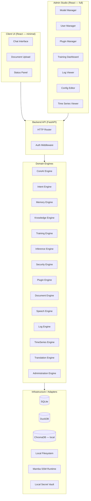

# Aegis — Global Architecture

## System Diagram



## Engine Responsibilities

| Engine | Responsibility |
|---|---|
| **CoreAI** | Orchestrates multi-engine pipelines; top-level AI controller |
| **Intent** | Classifies user intent; routes to correct engine chain |
| **Memory** | Short/long-term conversation memory, session state |
| **Knowledge** | RAG over local documents; vector search via ChromaDB |
| **Inference** | Runs Mamba/SSM models locally; manages model lifecycle |
| **Training** | Fine-tuning and continual learning jobs (local GPU/CPU) |
| **Security** | AuthN/AuthZ, JWT, RBAC, secret management, audit trail |
| **Plugin** | Sandboxed plugin loading, lifecycle, permissions |
| **Document** | Ingestion, parsing, chunking, indexing of local files |
| **Speech** | STT/TTS offline (e.g. Whisper local, Coqui TTS) |
| **Log** | Structured local logging, log rotation, query interface |
| **TimeSeries** | Metrics collection, DuckDB storage, trend analysis |
| **Translation** | Offline NMT translation (Argos Translate or similar) |
| **Administration** | System config, user management, health checks, backups |

## Technology Choices

### Inference Runtime
- **Chosen**: Mamba-SSM (`mamba-ssm` library, CUDA) / `mamba-minimal` (CPU fallback)
- **Why**: Only SSM-native runtime that is fully offline, no Transformer dependency, linear complexity
- **Alternative**: Pure Python selective-scan (slower, no CUDA required)

### Vector Store
- **Chosen**: ChromaDB (embedded mode, no server required)
- **Why**: Fully local, no external process, Python-native, offline installable
- **Alternative**: FAISS (no metadata filtering), LanceDB

### Primary DB
- **Chosen**: SQLite via SQLModel (async with aiosqlite)
- **Why**: Zero-server, single file, ACID, excellent Python support
- **Alternative**: PostgreSQL (overkill for local), TinyDB (no SQL)

### Analytics DB
- **Chosen**: DuckDB
- **Why**: Columnar, in-process, fast aggregations for logs/metrics, no server
- **Alternative**: SQLite (slower for analytical queries)

### Backend Framework
- **Chosen**: FastAPI + Uvicorn
- **Why**: Async, OpenAPI auto-docs, Pydantic-native, production-grade

### Frontend
- **Chosen**: React 18 + Vite
- **Why**: Component ecosystem, fast HMR, offline build via Vite

## Hexagonal Architecture

```
┌─────────────────────────────────────────┐
│              Domain Layer               │
│  (Engines, Entities, Value Objects,     │
│   Domain Events, Ports/Interfaces)      │
│  ← NO imports from infra or adapters →  │
├─────────────────────────────────────────┤
│           Application Layer             │
│  (Use Cases / Services — orchestrate    │
│   domain, call ports)                   │
├─────────────────────────────────────────┤
│        Infrastructure / Adapters        │
│  (SQLite, ChromaDB, Filesystem,         │
│   Mamba runtime, Vault — implement      │
│   the Port interfaces)                  │
├─────────────────────────────────────────┤
│           Interface Layer               │
│  (FastAPI routers, React UI,            │
│   CLI — call use cases only)            │
└─────────────────────────────────────────┘
```
